# Market Regime Classification for MRU/USD with Machine Learning

## Overview

This repository hosts an independent quantitative research project on supervised market regime classification for the MRU/USD exchange rate under strict time-series validation. The work studies how different regime label definitions and evaluation schemes affect what simple linear models can actually learn from a single, carefully cleaned daily FX series.

The repository primarily exposes the experimental notebooks, derived datasets, and diagnostic artefacts used in the study, with a focus on methodological transparency rather than turnkey deployment or production-ready code.

 

***

## Research Motivation

Financial time series are often described informally in terms of “regimes” such as bullish, bearish, or sideways periods, but turning this intuition into a supervised learning problem is non-trivial. This project investigates how two key design choices shape conclusions in market regime classification:

- How regimes are operationalized as discrete labels.
- How generalization is evaluated when observations are time-ordered and strongly dependent.

The study focuses on MRU/USD as a single-asset case study, using a daily OHLC series restricted to business days from 2000-01-03 to 2025-11-25. The goal is not to discover universal trading rules, but to understand how label design and time-respecting validation influence model behavior, including their characteristic failure modes on this specific market.

***

## Methodology

At a high level, the research pipeline is:

**Data → Feature Engineering → Labeling → Model Training → Prediction → Signal Generation → Backtesting → Evaluation**

The methodology is intentionally conservative:

- A single, cleaned OHLC time series for MRU/USD is used.
- Two families of regime labels (return-based and indicator-based) are defined explicitly.
- Models are restricted to transparent linear baselines (multinomial logistic regression and linear SVM).
- Validation strictly preserves temporal order via a chronological holdout split and walk-forward evaluation.
- Diagnostics emphasize per-class behavior, confusion matrices, and downstream trading behavior rather than a single headline metric.

For a visual overview of the experimental pipeline, see **Figure 6 – Vue d’ensemble du pipeline expérimental**.

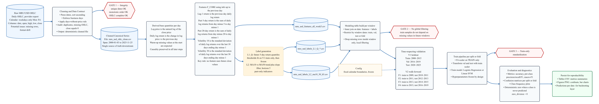

***

## Data and Feature Engineering

The core dataset is a daily MRU/USD OHLC series:

- Source: central-bank style exchange-rate data (MRU vs USD).
- Frequency: business days only.
- Window: 2000-01-03 to 2025-11-25 (6,752 observations after cleaning).
- Cleaning: removal of non-trading days, quality checks on OHLC fields, and construction of a consistent, gap-aware OHLC series.

From this base series, derived quantities include:

- Log returns over various horizons.
- Rolling volatility proxies (e.g., 30-day and 90-day rolling volatility).
- Additional time-indexed series used downstream for label generation and feature construction.

To avoid information leakage, features at time $t$ are constructed to depend only on information available up to $t-1$. This causal alignment is enforced consistently across all experiments.

For exploratory visual diagnostics, see:

- **Figure 3 – Régimes L1_Q superposés au prix de clôture** (sanity check of L1_Q label definition).
- **Figure 4 – Régimes L2 superposés au prix de clôture** (sanity check of L2 label definition).

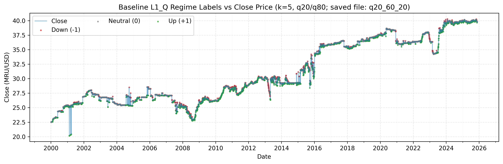
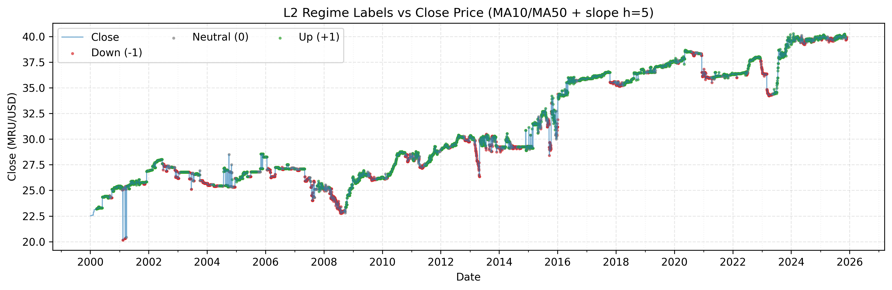

***

## Market Regime Labeling

Regimes are framed as an ordered three-class problem:

- Classes: {−1, 0, +1} ≡ {down, neutral, up}.

Two main label families are defined and compared.

### L1 – Return-based labels (future horizon)

L1-type labels define regimes using a 5-day future log return:

- $R^{(5)}_t = \log(P_{t+5}) - \log(P_t)$.
- Three-class assignment based on thresholds.

Two documented variants:

- **L1_Q – Quantile-based labels**
    - Thresholds: lower and upper quantiles (e.g., 20% and 80%) computed only on the training window.
    - Interpretation: classifies observations into lower tail, central region, and upper tail of future returns.
- **L1_extreme – Volatility-scaled thresholds**
    - A symmetric threshold proportional to training-period volatility and scaled by $\sqrt{5}$.
    - Emphasizes “extreme” moves relative to typical volatility, with a neutral band in the middle.

Because L1 labels depend on future returns, the pipeline implements explicit boundary purges: for each training window, the last five dates are removed from training so that all retained training labels depend only on prices within the training window.

The label construction and comparisons between L1 and L2 are summarized in **Figure 2 – Génération des labels (L1 et L2)**.

diagram_labels_B.svg
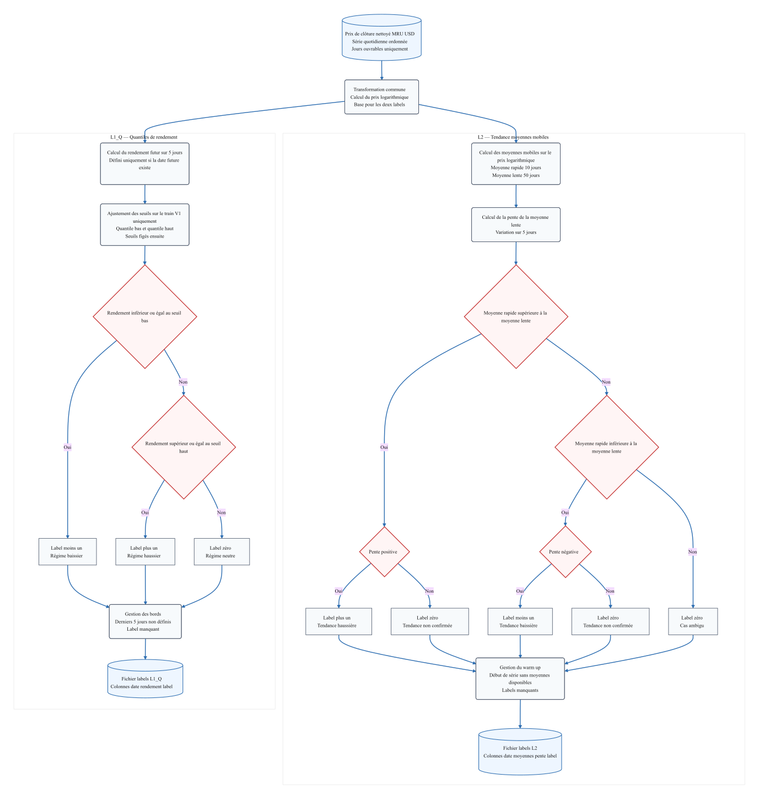

### L2 – Indicator-based trend labels

L2 labels define regimes from moving-average structure:

- Inputs: log-price series with MA10 (fast) and MA50 (slow) moving averages.
- Additional slope proxy: a 5-day difference of the slow moving average.
- Label mapping:
    - +1 (up): fast MA above slow MA and slow-MA slope positive.
    - −1 (down): fast MA below slow MA and slow-MA slope negative.
    - 0 (neutral): otherwise.

Warm-up periods where MA values or slope are undefined are labeled as NaN and removed during window-local alignment. To avoid circularity, features directly encoding the L2 rule (e.g., raw MA cross terms) are excluded from the core modeling feature set in the main experiments.

Agreement and disagreement between L1_Q and L2 over time are visualized in:

- **Figure 5 – Accord entre familles de labels (L1_Q vs L2)**.

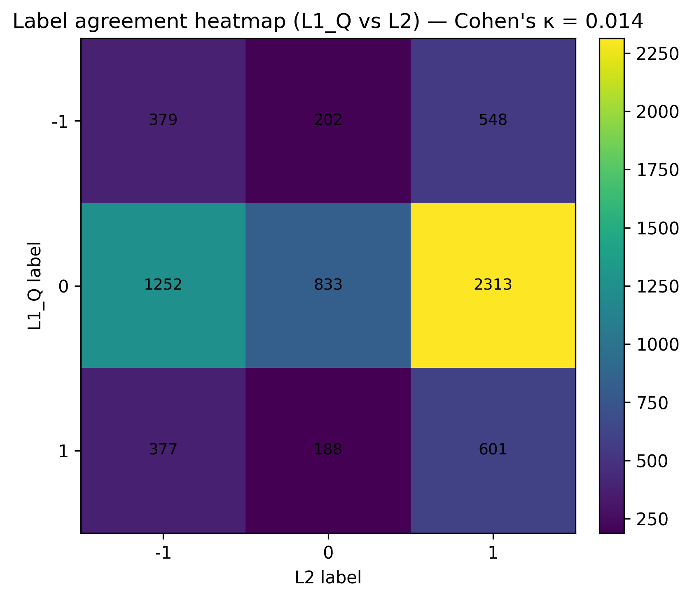


***

## Modeling Approach

The project deliberately uses simple, auditable classifiers:

- **Multinomial Logistic Regression**
    - Interpretable linear decision surfaces with probabilistic outputs.
    - Regularization and fixed hyperparameters to control capacity.
- **Linear Support Vector Machines (LinearSVC)**
    - Margin-based linear classifier with fixed configuration.
    - Used as a complementary baseline to logistic regression.

Key modeling principles:

- The same compact **core feature set (F_CORE)**, derived from price and return structure, is used across all experiments.
- Features are standardized using statistics computed **only on the training subset** for each split/fold; the same transform is then applied to validation/test.
- Random seeds and configuration choices are fixed by design to favor reproducibility and reduce degrees of freedom.

The exact content and timing of the core features are documented in the original study (see, for example, **Tableau 10 – Définitions des features cœur et timing**).

***

## Validation Framework

The evaluation is strictly time-respecting, with two complementary schemes:

### V1 – Chronological holdout split

A single chronological split into three contiguous blocks:

- Training: 2000-01-03 to 2015-12-31.
- Validation: 2016-01-01 to 2019-12-31.
- Test: 2020-01-01 to 2025-11-25.

This configuration answers: “If we train once on the early history, how does the model perform on later periods?”

### V2 – Walk-forward with expanding window

Four walk-forward folds with expanding training windows and non-overlapping test windows:

- F1: Train up to 2009-12-31, test on 2010–2011.
- F2: Train up to 2011-12-30, test on 2012–2013.
- F3: Train up to 2013-12-31, test on 2014–2015.
- F4: Train up to 2015-12-31, test on 2016–2019.

This configuration tests the stability of performance across multiple out-of-sample windows in the presence of potential non-stationarity.

To mitigate leakage, the pipeline enforces:

- Train-only fitting of preprocessing (e.g., standardization).
- Window-local alignment of features and labels.
- Local handling of NaNs.
- Boundary purges for horizon-defined labels (L1).

The validation windows are summarized in **Tableau 1 – Fenêtres de validation (V1 et V2)** and illustrated in **Figure 1 – Chronologie de validation (V1 holdout et plis V2 walk-forward)**.


| Schéma | Segment/Pli | Train début  | Train fin    | n train | Test/Val début | Test/Val fin  | n test/val |
|--------|------------|-------------|-------------|---------|----------------|---------------|------------|
| V1     | Train      | 2000-01-03  | 2015-12-31  | 4169    | —              | —             | —          |
| V1     | Validation | —           | —           | —       | 2016-01-01     | 2019-12-31    | 1043       |
| V1     | Test       | —           | —           | —       | 2020-01-01     | 2025-11-25    | 1540       |
| V2     | F1         | 2000-01-03  | 2009-12-31  | 2604    | 2010-01-01     | 2011-12-30    | 521        |
| V2     | F2         | 2000-01-03  | 2011-12-30  | 3125    | 2012-01-02     | 2013-12-31    | 522        |
| V2     | F3         | 2000-01-03  | 2013-12-31  | 3647    | 2014-01-01     | 2015-12-31    | 522        |
| V2     | F4         | 2000-01-03  | 2015-12-31  | 4169    | 2016-01-01     | 2019-12-31    | 1043       |

-
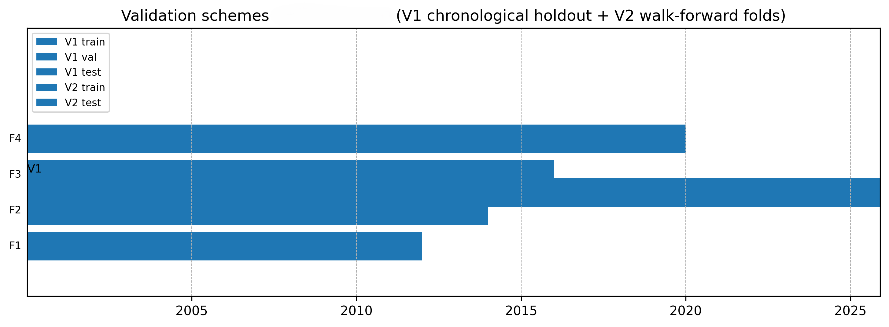
***

## Trading Strategy Evaluation

Classification outputs are mapped to simple long/short/flat strategies to assess whether differences in classification quality translate into meaningfully different trading behavior.

Key elements:

- **Signals**:
    - +1 → long MRU/USD
    - −1 → short MRU/USD
    - 0 → flat
- **Execution timing**:
    - One-day execution lag between signal and realized return to avoid same-day look-ahead.
- **Baselines**:
    - Simple reference strategies (e.g., always-long, always-flat, or rules derived from labels) used as transparent comparators.
- **Metrics**:
    - Cumulative log return.
    - Maximum drawdown.
    - Aggregated performance over walk-forward folds.

Equity curves for the main strategies and baselines are presented in:

- **Figure 16 – Courbes d’équité sous V1 (T1, T2, B1 et B2)**.
- **Figures 17–20 – Courbes d’équité sous V2, plis F1 à F4**.

### Figure 16 – Courbes d’équité sous V1
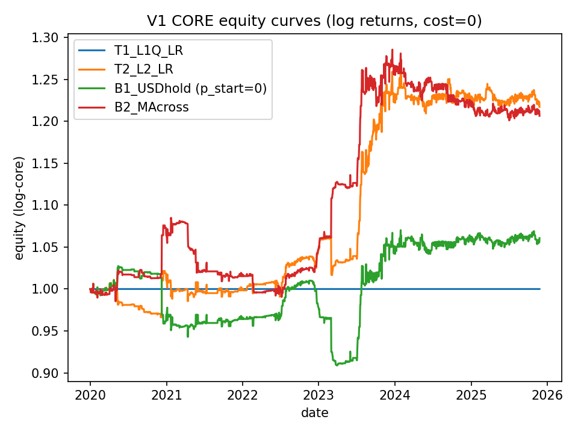

### Figure 17 – Courbe d’équité sous V2, pli F1
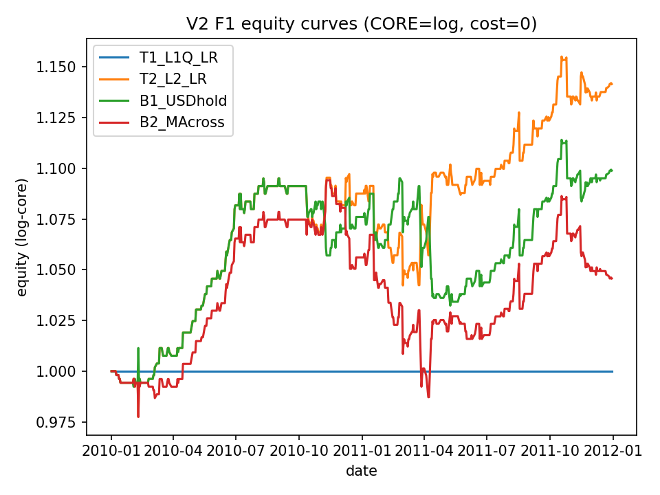

### Figure 18 – Courbe d’équité sous V2, pli F2
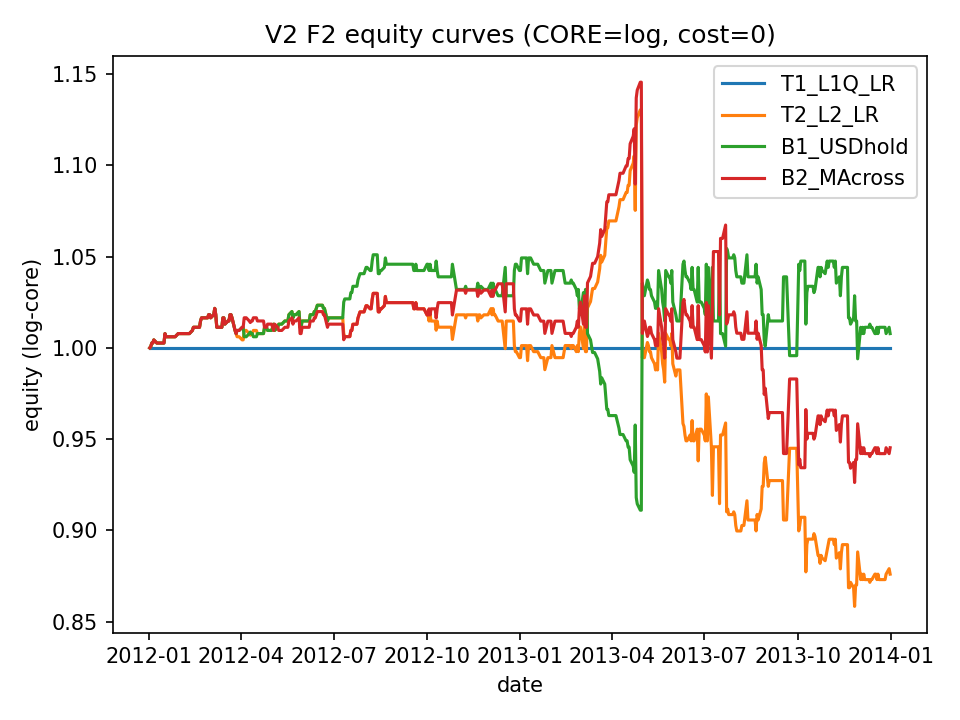

### Figure 19 – Courbe d’équité sous V2, pli F3
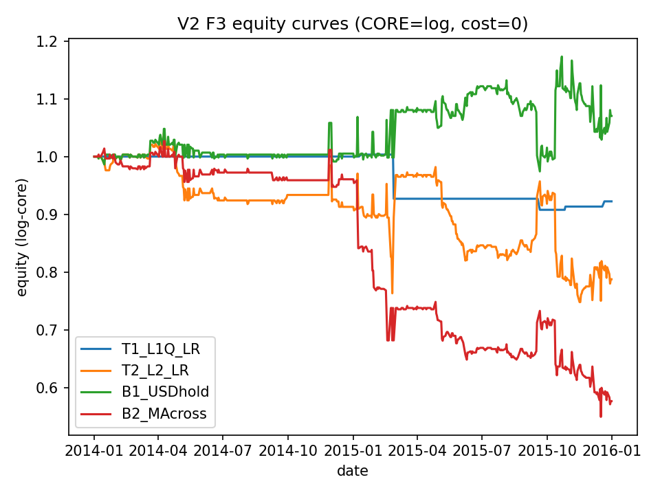

### Figure 20 – Courbe d’équité sous V2, pli F4
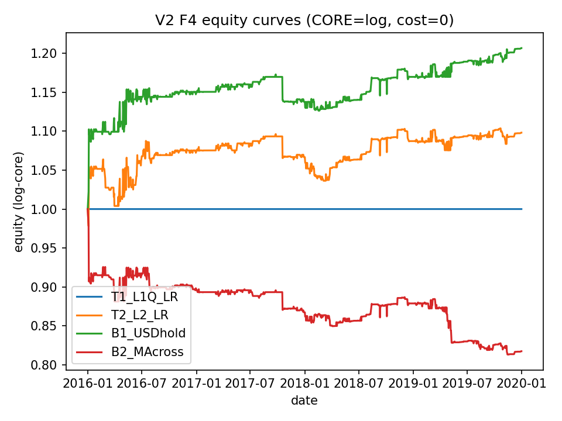
***

## Results

### Classification performance

Across experiments, the choice of label family has a strong impact on performance:

- **L2 (indicator-based trend labels)**
    - Achieves higher Macro-F1, typically in the range of roughly 0.41–0.44 on the main test configurations.
    - Shows more stable behavior across V1 and V2 splits.
- **L1_Q (quantile-based return labels)**
    - Lower Macro-F1, around 0.24–0.28 in comparable settings.
    - More sensitive to label imbalance and horizon effects.

For both label families, a consistent failure mode emerges:

- The **neutral regime (0)** is the hardest to predict reliably.
- Confusion matrices show a tendency for models to collapse toward non-neutral classes or misclassify neutral periods, even when overall accuracy appears reasonable.

These patterns are detailed in:


#### Tableau 14 — Synthèse des performances sur l’ensemble de test

| Exp | Label | Validation | Modèle              | Ligne test   | Accuracy | Macro-F1 |
| --- | ----- | ---------- | ------------------- | ------------ | -------- | -------- |
| E1  | L1_Q  | V1         | Logistic Regression | V1_test      | 0.731596 | 0.281665 |
| E2  | L1_Q  | V2         | Logistic Regression | V2_test_mean | 0.561251 | 0.238155 |
| E3  | L1_Q  | V1         | LinearSVC           | V1_test      | 0.731596 | 0.281732 |
| E4  | L1_Q  | V2         | LinearSVC           | V2_test_mean | 0.562209 | 0.238412 |
| E5  | L2    | V1         | Logistic Regression | V1_test      | 0.627273 | 0.424743 |
| E6  | L2    | V1         | LinearSVC           | V1_test      | 0.616883 | 0.408606 |
| E7  | L2    | V2         | Logistic Regression | V2_test_mean | 0.644413 | 0.437053 |
| E8  | L2    | V2         | LinearSVC           | V2_test_mean | 0.642745 | 0.431617 |

---

#### Tableau 15 — Métriques L2 sous V1 (E5, Régression logistique)

| Split | Accuracy | Macro-F1 | F1(-1)   | F1(0)    | F1(+1)   |
| ----- | -------- | -------- | -------- | -------- | -------- |
| train | 0.625273 | 0.458824 | 0.622106 | 0.027743 | 0.726623 |
| val   | 0.693193 | 0.398764 | 0.369004 | 0.000000 | 0.827289 |
| test  | 0.627273 | 0.424743 | 0.533700 | 0.000000 | 0.740528 |

---

#### Tableau 16 — Métriques L2 sous V1 (E6, LinearSVC)

| Split | Accuracy | Macro-F1 | F1(-1)   | F1(0)    | F1(+1)   |
| ----- | -------- | -------- | -------- | -------- | -------- |
| train | 0.625273 | 0.455614 | 0.621762 | 0.023107 | 0.721975 |
| val   | 0.703739 | 0.401000 | 0.370370 | 0.000000 | 0.832628 |
| test  | 0.616883 | 0.408606 | 0.493976 | 0.000000 | 0.731844 |

---

#### Tableau 17 — Matrice de confusion L2 (E5, test V1)

|         | pred −1 | pred 0 | pred +1 |
| ------- | ------- | ------ | ------- |
| true −1 | 194     | 0      | 263     |
| true 0  | 33      | 0      | 235     |
| true +1 | 43      | 0      | 772     |

---

#### Tableau 18 — Matrice de confusion L2 (E6, test V1)

|         | pred −1 | pred 0 | pred +1 |
| ------- | ------- | ------ | ------- |
| true −1 | 164     | 0      | 293     |
| true 0  | 14      | 0      | 254     |
| true +1 | 29      | 0      | 786     |

---

#### Tableau 19 — Métriques de test par pli sous V2 (E7)

| Pli | Accuracy | Macro-F1 | F1(-1)   | F1(0)    | F1(+1)   |
| --- | -------- | -------- | -------- | -------- | -------- |
| F1  | 0.687140 | 0.483264 | 0.652174 | 0.000000 | 0.797619 |
| F2  | 0.685824 | 0.487119 | 0.676768 | 0.000000 | 0.784588 |
| F3  | 0.511494 | 0.379064 | 0.498660 | 0.000000 | 0.638532 |
| F4  | 0.693193 | 0.398764 | 0.369004 | 0.000000 | 0.827289 |

---

#### Tableau 20 — Métriques de test par pli sous V2 (E8)

| Pli | Accuracy | Macro-F1 | F1(-1)   | F1(0)    | F1(+1)   |
| --- | -------- | -------- | -------- | -------- | -------- |
| F1  | 0.700576 | 0.493931 | 0.674157 | 0.000000 | 0.807636 |
| F2  | 0.670498 | 0.473166 | 0.652055 | 0.000000 | 0.767442 |
| F3  | 0.496169 | 0.358370 | 0.438746 | 0.000000 | 0.636364 |
| F4  | 0.703739 | 0.401000 | 0.370370 | 0.000000 | 0.832628 |

---

#### Figures 7–14 — Fréquences des classes prédites

#### Figure 7 — Fréquence des classes prédites L1_Q sur le test V1 (E1)

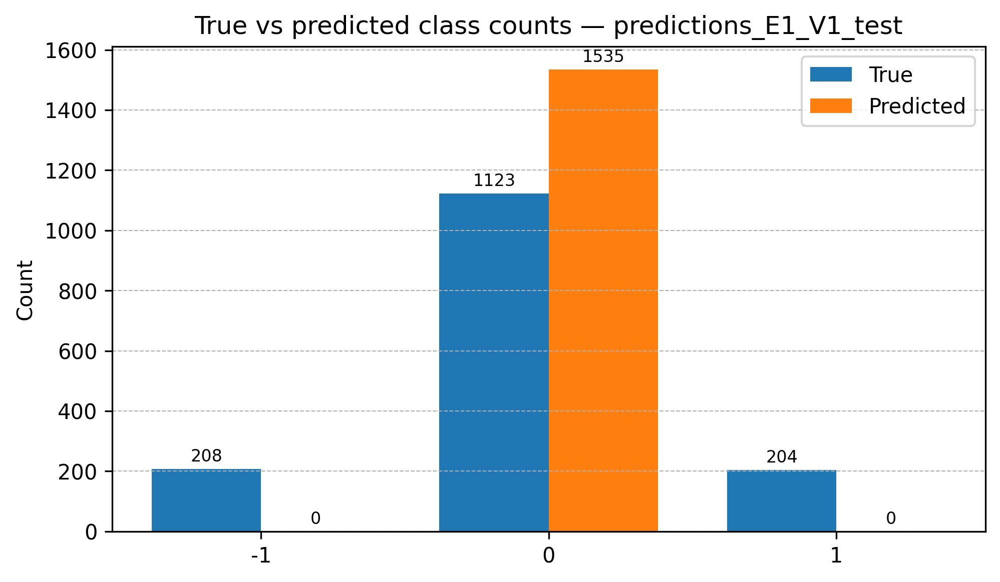

---

#### Figure 8 — Fréquence des classes prédites L1_Q sur le test V1 (E3)


---

#### Figure 9 — Fréquence des classes prédites L1_Q agrégée sur les plis V2 (E2)


---

#### Figure 10 — Fréquence des classes prédites L1_Q agrégée sur les plis V2 (E4)

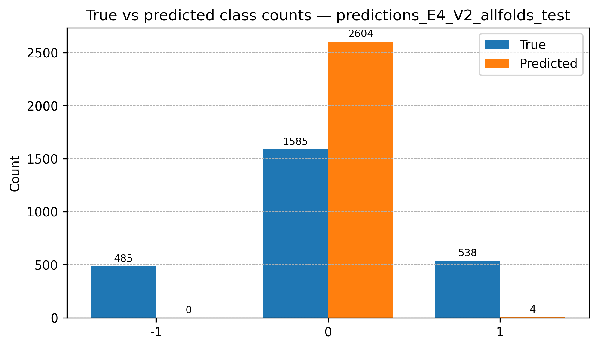

---

#### Figure 11 — Fréquence des classes prédites L2 sur le test V1 (E5)

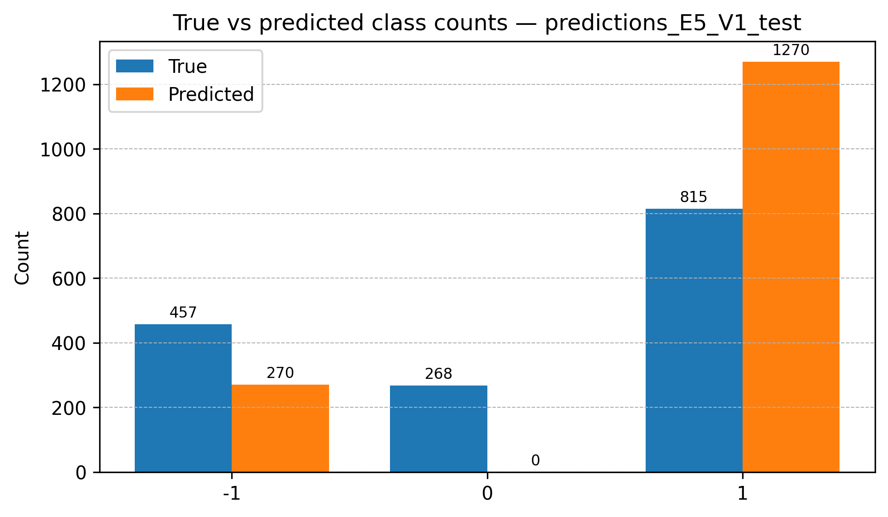

---

#### Figure 12 — Fréquence des classes prédites L2 sur le test V1 (E6)

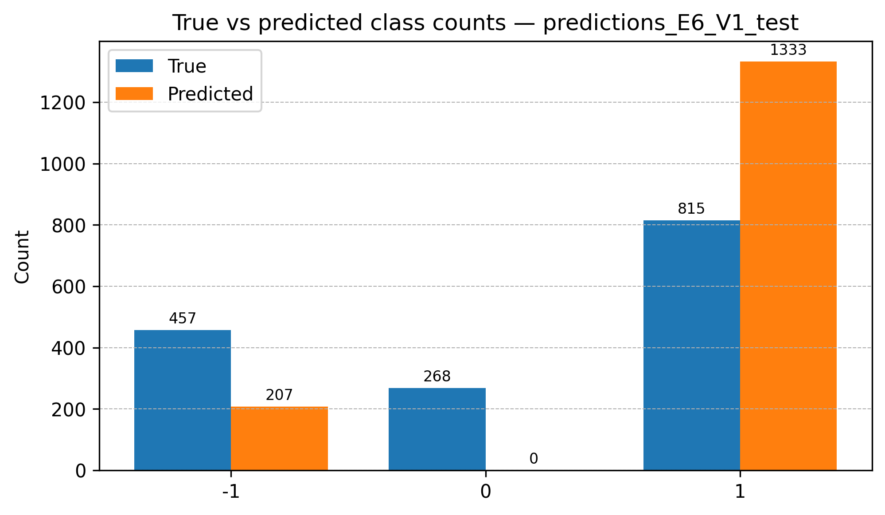

---

#### Figure 13 — Fréquence des classes prédites L2 agrégée sur les plis V2 (E7)

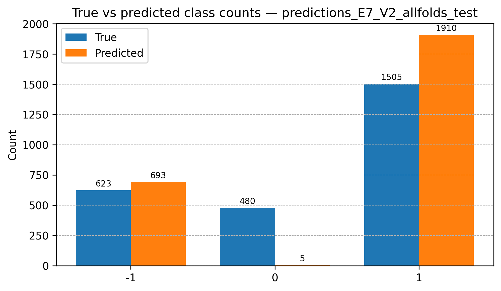

---

#### Figure 14 — Fréquence des classes prédites L2 agrégée sur les plis V2 (E8)

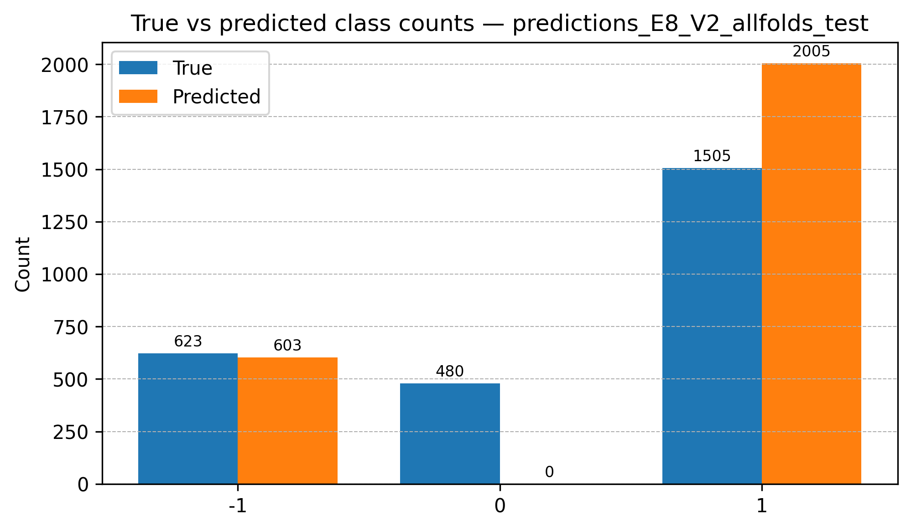


### Backtesting outcomes

Backtest results are used as downstream diagnostics rather than as primary optimization targets:

- Strategies derived from L2-based models generally outperform L1_Q-based strategies on the tested windows, but:
    - Differences versus simple baselines are modest and sensitive to the evaluation window.
    - Performance remains subject to variance and the limited effective sample size of test periods.
- The backtests illustrate:
    - How classification instability and label design propagate into equity curves.
    - That apparent classification gains do not automatically translate into robust trading edges.

Aggregated walk-forward backtest statistics are summarized in:


#### Tableau 21 — Rendement logarithmique cumulé et drawdown maximal par pli sous V2

| Stratégie           | Pli | Rendement log cumulé | Drawdown max |
| ------------------- | --- | -------------------- | ------------ |
| B1 (USD hold)       | F1  | 0.0943               | -0.0573      |
|                     | F2  | 0.0078               | -0.1332      |
|                     | F3  | 0.0680               | -0.1394      |
|                     | F4  | 0.1880               | -0.0398      |
| B2 (croisement MA)  | F1  | -0.0099              | -0.1087      |
|                     | F2  | -0.1011              | -0.2170      |
|                     | F3  | -0.4757              | -0.3995      |
|                     | F4  | -0.1354              | -0.1320      |
| T2 (L2, logistique) | F1  | 0.1324               | -0.0500      |
|                     | F2  | -0.1324              | -0.2408      |
|                     | F3  | -0.2389              | -0.2814      |
|                     | F4  | 0.0937               | -0.0563      |

---

#### Tableau 22 — Performance moyenne sur les plis V2

| Stratégie           | Rendement log cumulé moyen | Drawdown max moyen |
| ------------------- | -------------------------- | ------------------ |
| B1 (USD hold)       | 0.0895                     | -0.0924            |
| B2 (croisement MA)  | -0.1805                    | -0.2143            |
| T1 (L1, logistique) | -0.0202                    | -0.0238            |
| T2 (L2, logistique) | -0.0363                    | -0.1571            |


***

## Repository Structure

The repository is organized around configuration, data artefacts, research notebooks, and downstream outputs:

```text
MRU_FX_ML_Project/
├── config/
│   └── labels_features.yaml        # Label and feature configuration
├── data/
│   ├── raw/                        # Source exchange-rate data (e.g., bcm_exchange_rates.csv)
│   ├── processed/                  # Cleaned OHLC series (e.g., mru_usd_ohlc_clean.csv)
│   └── derived/                    # Derived features and label tables
├── notebooks/
│   ├── eda/                        # Exploratory analysis and label/feature construction
│   ├── modeling/                   # Modeling and experimental workflows
│   └── diagnostics/                # Additional diagnostics and sanity checks
├── results/
│   ├── backtests/                  # Backtest-level CSV outputs
│   ├── figures/                    # Exported figures (confusion matrices, equity curves, etc.)
│   ├── metrics/                    # Aggregated classification metrics and confusion matrices
│   └── predictions/                # Per-experiment test set predictions
├── requirements.txt                # Python environment dependencies

```


***

## Experimental Notebooks and Codebase Note

This repository shares **research notebooks**, not a polished software package:

- The notebooks reflect an **experimental workflow** conducted over time.
- Several previously separate Python scripts and notebooks were **merged into larger notebooks**, which means:
    - Some preprocessing, labeling, or evaluation steps are intentionally **repeated** across cells or files.
    - Certain notebooks may contain **overlapping or redundant code**, legacy cells, and exploratory diagnostics.
- The focus is on methodological clarity and reproducibility of decisions, not on minimal or perfectly factored code.

As a result:

- The project is **not intended as a one-command, fully automated pipeline**.
- Running notebooks end-to-end may require:
    - Adjusting paths or environment settings.
    - Understanding the experimental context of each notebook cell.
- The primary purpose of exposing the notebooks is **transparency**: readers can inspect how labels, validation schemes, and diagnostics were implemented in practice.

***

## Intended Use

This repository is intended for:

- **Researchers and practitioners in financial machine learning** interested in:
    - Market regime classification on a less-studied FX pair.
    - The impact of label design and time-series validation on supervised learning outcomes.
    - Concrete anti-leakage practices in time-ordered data.
- **Developers and engineers** evaluating:
    - How to structure a research pipeline around clear experimental contracts and artefact persistence.
    - How to tie classification results to simple, transparent backtests.
- **Recruiters or hiring managers** reviewing:
    - End-to-end ownership of a quantitative research project.
    - Ability to combine data engineering, methodological rigor, and diagnostic reporting.

It is **not** a trading signal service, production trading system, or plug-and-play strategy library.

***

## Disclaimer

- This project is a **research exercise**, focused on methodology rather than live trading.
- The results are **specific to MRU/USD** and to the period and data sources described; they should not be assumed to generalize to other markets or horizons.
- Backtests are **simplified** and do not account for all real-world frictions (e.g., liquidity constraints, slippage, execution risk).
- Nothing in this repository constitutes financial advice or a recommendation to trade any instrument.


***

## License

This project is released under the MIT License.

You are free to use, modify, distribute, and build upon this work for any purpose, 

***

## Project Pipeline Summary

For quick reference, the conceptual workflow implemented by the notebooks and artefacts is:

> **Data → Feature Engineering → Labeling (L1/L2) → Time-Series Splits (V1/V2) → Model Training (Logistic Regression / Linear SVM) → Prediction → Regime-Based Signals → Backtesting → Evaluation (Macro-F1, confusion matrices, equity curves, drawdown)**

This pipeline is reflected across the `data/`, `notebooks/`, and `results/` directories, with configuration details centralized in `config/labels_features.yaml` and dependencies listed in `requirements.txt`.
